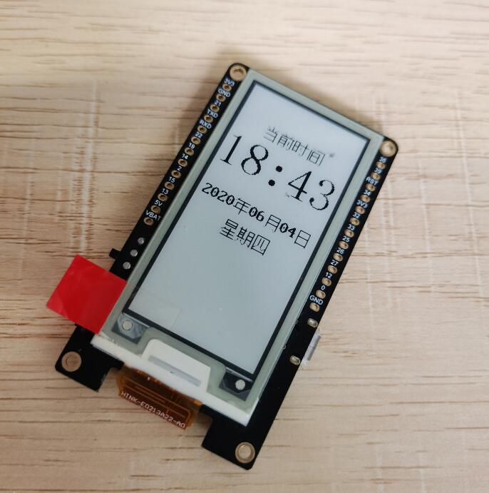

# TTGO-T5-V2.3-水墨屏网络时钟

### 使用说明：

1. 开发板使用`firmware`目录中固件,仅对**esp32-idf4-20191220-v1.12**进行测试
2. 修改app_time.py文件中的CONFIG_WIFI配置，改成自己的wifi信息即可
3. 所有文件都要上传到开发板中,可以使用[uPyLoader](https://github.com/BetaRavener/uPyLoader/releases)进行上传,也可以使用其他方式上传
4. 修改screen.py中的init方法、update方法和update_fast方法，即可完成不同屏幕的移植

**本仓库代码，来源与交流群Dreagonmon贡献**